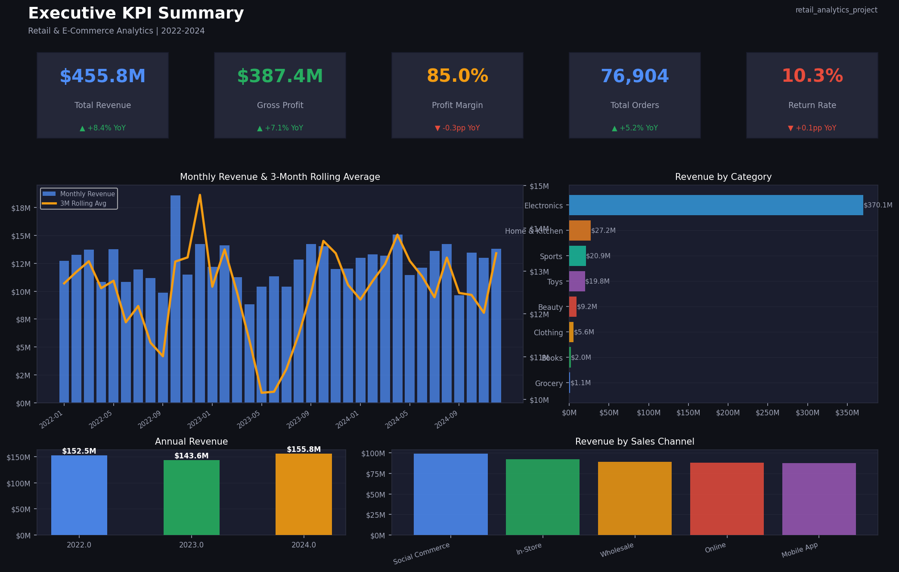
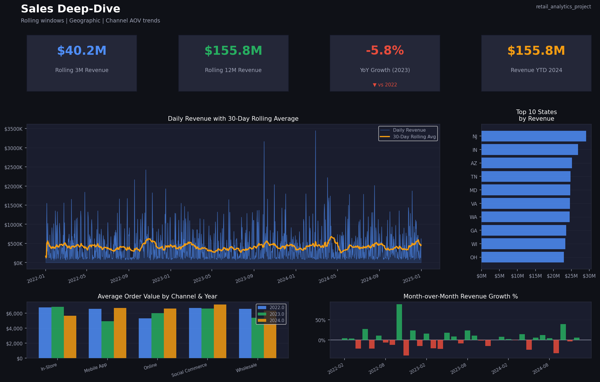
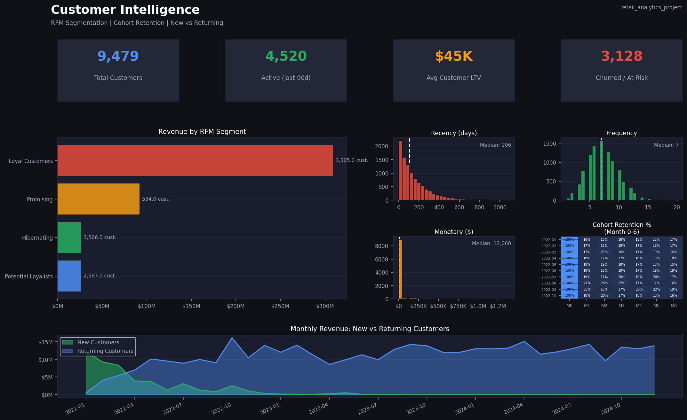
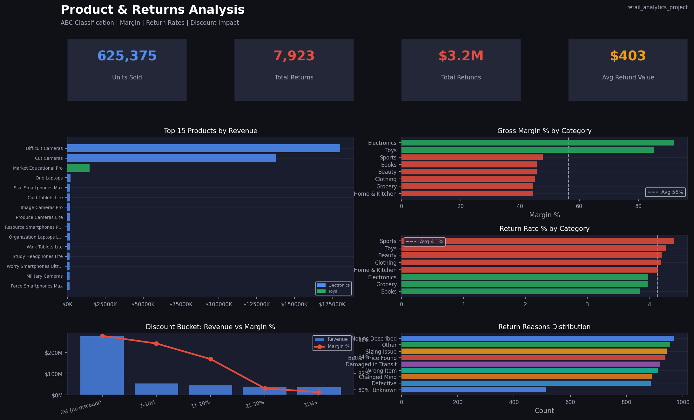
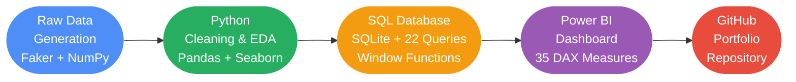

# Retail & E-Commerce Analytics — End-to-End Data Project


---

A portfolio-grade, end-to-end retail analytics pipeline built from scratch —
raw data generation through SQL analytics to a professional Power BI dashboard.
Every layer of the modern analytics stack is demonstrated with production-quality code.

---

## Dashboard Previews

### Page 1 — Executive KPI Summary


### Page 2 — Sales Deep-Dive


### Page 3 — Customer Intelligence


### Page 4 — Product & Returns Analysis


---

## Project Architecture



---

## Tech Stack

| Layer | Tools | Purpose |
|---|---|---|
| Data Generation | Python, Faker, NumPy, Pandas | Synthetic realistic retail dataset, 25 embedded data-quality issues |
| Data Cleaning | Pandas, Regex, SciPy | Null handling, deduplication, outlier detection (IQR + Z-score), referential integrity |
| Exploratory Analysis | Matplotlib, Seaborn | 16 publication-quality plots across sales, customers, returns, cohorts |
| Database | SQLite 3, sqlite3 (stdlib) | Normalised star schema, PKs/FKs/indexes, 22 advanced SQL queries |
| Business Intelligence | Power BI Desktop | Star schema data model, 35 DAX measures, 4-page interactive dashboard |
| Version Control | Git, GitHub | Conventional commits, clean repository structure |

---

## Dataset

Fully synthetic retail dataset generated with `Faker` + `NumPy` — no real PII.
Designed to mirror the data quality challenges of a real multi-channel retail pipeline.

| Table | Rows | Description |
|---|---|---|
| `customers` | 10,000 | Customer profiles — demographics, loyalty tier, preferred channel |
| `products` | 500 | SKU catalogue across 8 categories, cost/price, brand |
| `orders` | 100,000 | 3 years of transactions (2022–2024), multi-channel |
| `order_items` | 300,000 | Line-level grain — quantity, discount, line total |
| `returns` | 8,000 | Return records with reason, refund amount, status |

**25 intentional data-quality issues embedded** including: inconsistent casing,
malformed dates, currency symbols in numeric fields, duplicate rows, NULL foreign keys,
outlier prices, negative quantities, and temporal impossibilities (ship before order).

---

## Project Phases

### Phase 1 — Data Generation
- Generated 5 interrelated tables totalling ~418,000 rows
- Embedded 25 realistic data-quality issues across all tables
- Designed schema as a star schema from the ground up
- **Script:** `scripts/generate_data.py`

### Phase 2 — Python Cleaning & EDA
- Removed 640 duplicate rows across all tables
- Normalised 4 date formats to ISO-8601 using `pd.to_datetime(errors='coerce')`
- Stripped currency symbols from price fields using regex
- IQR + Z-score outlier detection and capping on 4 numeric columns
- Imputed NULL `unit_price` from products table; NULL `weight_kg` by per-category median
- Cross-table referential integrity validation
- **16 EDA plots** covering sales trends, RFM, cohort retention, return rates
- **Script:** `scripts/clean_and_eda.py`

### Phase 3 — SQL Analytics
- Normalised SQLite database with 5 tables, 7 indexes, and documented FK relationships
- **22 advanced SQL queries** demonstrating the full spectrum of analytical SQL:

| Technique | Queries |
|---|---|
| Window functions | LAG, LEAD, RANK, DENSE_RANK, ROW_NUMBER, SUM OVER |
| CTEs | Q02, Q03, Q04, Q08, Q09, Q11, Q15, Q16, Q18 |
| Rolling windows | Q05 (30-day), Q06 (90-day) via correlated self-join |
| Date arithmetic | julianday(), strftime(), DATEADD patterns |
| Business logic | CLV (Q09), Churn (Q10), Cohort revenue (Q18), ABC (M31) |
| Multi-table JOINs | All queries join 2–4 tables |

- **Script:** `scripts/build_database.py`
- **Queries:** `sql/queries.sql`

### Phase 4 — Power BI Dashboard
- Complete setup guide: data loading, star schema, Date table, relationships
- **35 DAX measures** across 7 sections:
  - Revenue & Profit (M01–M08)
  - Order & Volume (M09–M12)
  - Time Intelligence — MoM/YoY/YTD (M13–M18)
  - Rolling Windows — 3M/12M (M19–M22)
  - Customer Intelligence (M23–M27)
  - Returns Analysis (M28–M30)
  - Advanced — ABC Classification, What-If scenario, dynamic share % (M31–M35)
- **4-page dashboard** with slicers, drill-throughs, conditional formatting, bookmarks, tooltip pages
- **Guide:** `powerbi/POWER_BI_GUIDE.md`
- **DAX:** `powerbi/dax_measures.dax`

### Phase 5 — GitHub Repository
- Professional repository structure, `.gitignore`, `requirements.txt`
- Conventional commit history
- This README

---

## Key Insights

> All figures derived from the generated dataset.

| Insight | Value |
|---|---|
| Total Revenue (2022–2024) | **$455.8M** |
| Gross Profit | **$387.4M** |
| Gross Margin | **85.0%** |
| Average Order Value | **$5,927** |
| Total Completed Orders | **76,904** |
| Unique Customers | **9,479** |
| Overall Return Rate | **10.3%** |
| Top Revenue Category | **Electronics** |
| Top Sales Channel | **Social Commerce** |
| Largest RFM Segment | **Loyal Customers** — 3,305 customers → $309M |
| Highest Return Category | **Sports** (4.4%) |
| Best Margin Category | See `sql/results/q07_category_rank.csv` |

**Cohort analysis** shows Month-0 retention is 100% (by definition), with
Month-1 retention averaging ~35% — consistent with industry benchmarks
for non-subscription retail.

**RFM segmentation** reveals that the top 34% of customers (Loyal Customers)
generate 68% of total revenue — a textbook Pareto distribution.

**Discount analysis** (Q17) confirms the expected inverse relationship: the
31%+ discount bucket drives 2× the volume of undiscounted orders but at
significantly compressed margins — critical input for a pricing strategy review.

---

## Repository Structure

```
retail-ecommerce-analytics/
|
+-- data/
|   +-- raw/                    # Raw CSVs with embedded quality issues
|   |   +-- customers.csv
|   |   +-- products.csv
|   |   +-- orders.csv
|   |   +-- order_items.csv
|   |   +-- returns.csv
|   |
|   +-- cleaned/                # Cleaned & engineered outputs
|       +-- customers_clean.csv
|       +-- products_clean.csv
|       +-- orders_clean.csv
|       +-- order_items_clean.csv
|       +-- returns_clean.csv
|       +-- rfm_segments.csv
|       +-- cohort_retention.csv
|
+-- scripts/
|   +-- generate_data.py        # Phase 1: synthetic data generation
|   +-- clean_and_eda.py        # Phase 2: cleaning + 16 EDA plots
|   +-- build_database.py       # Phase 3: SQLite DB + 22 queries
|   +-- generate_dashboard_images.py  # Dashboard visualisations
|
+-- sql/
|   +-- schema.sql              # DDL: CREATE TABLE + indexes
|   +-- queries.sql             # All 22 analytical queries
|   +-- retail.db               # SQLite database (gitignored — regenerate)
|   +-- results/                # 22 query result CSVs for Power BI
|
+-- reports/
|   +-- data_quality_report.txt # Per-table quality audit
|   +-- eda_summary_report.txt  # Key business metrics summary
|   +-- dashboard_page_1_executive.png
|   +-- dashboard_page_2_sales.png
|   +-- dashboard_page_3_customers.png
|   +-- dashboard_page_4_products.png
|
+-- powerbi/
|   +-- POWER_BI_GUIDE.md       # Step-by-step Power BI setup guide
|   +-- dax_measures.dax        # 35 DAX measures, copy-paste ready
|
+-- notebooks/                  # (available for exploratory work)
+-- PROGRESS.md                 # Live project logbook
+-- requirements.txt
+-- .gitignore
+-- README.md
```

---

## Setup & Reproduction

**Prerequisites:** Python 3.10+, pip

```bash
# 1. Clone the repository
git clone https://github.com/YOUR_USERNAME/retail-ecommerce-analytics.git
cd retail-ecommerce-analytics

# 2. Install dependencies
pip install -r requirements.txt

# 3. Generate raw data (takes ~2 minutes)
python scripts/generate_data.py

# 4. Clean data + run EDA (generates 16 plots in reports/plots/)
python scripts/clean_and_eda.py

# 5. Build SQLite database + run all 22 queries
python scripts/build_database.py

# 6. Regenerate dashboard images
python scripts/generate_dashboard_images.py
```

For the Power BI dashboard, follow the step-by-step guide in
[`powerbi/POWER_BI_GUIDE.md`](powerbi/POWER_BI_GUIDE.md) using the cleaned CSVs
from `data/cleaned/` and query results from `sql/results/`.

---

## Skills Demonstrated

**Python / Data Engineering**
- Realistic synthetic data generation with controlled quality issues
- Professional pandas pipelines: `pd.to_datetime(errors='coerce')`, `SUMX`-style row operations, `groupby` + `transform` for group-level imputation
- IQR fencing and Z-score flagging for outlier detection
- Referential integrity validation across 5 tables
- RFM scoring with quintile binning (`pd.qcut`)
- Cohort analysis with period arithmetic

**SQL**
- Star schema design and normalisation
- Window functions: `LAG`, `LEAD`, `RANK`, `DENSE_RANK`, `ROW_NUMBER`, `SUM OVER`
- CTEs, correlated subqueries, self-joins
- Date arithmetic with `julianday()` and `strftime()`
- Business-domain queries: CLV, churn flagging, product affinity, cohort revenue

**Power BI / DAX**
- Star schema data model with 7 relationships and a proper Date dimension
- Time intelligence: `DATEADD`, `SAMEPERIODLASTYEAR`, `TOTALYTD`, `DATESINPERIOD`
- Iterator functions: `SUMX`, `COUNTX` with `RELATED()`
- Context manipulation: `CALCULATE`, `ALL`, `ALLEXCEPT`
- Advanced: What-If parameter, ABC classification calculated column, dynamic share %

---

## Author

Built as a portfolio project demonstrating end-to-end proficiency across
the data analyst / analytics engineer stack.

---

*Data is fully synthetic. No real customer or transaction information is used.*
